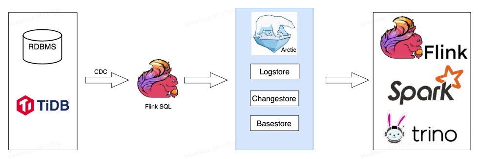
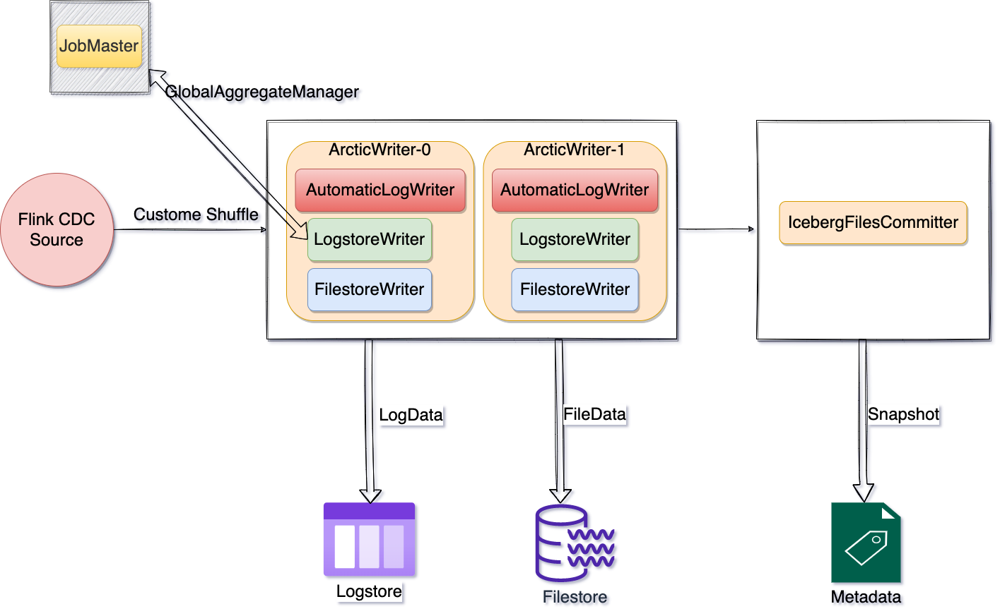

# Flink CDC ingest into Lake Arctic
CDC is short for Change Data Capture, which is a broad concept. As long as the changed data can be captured, it can be called CDC. Flink CDC is a data capture tool based on Log messages, and all historical and incremental data can be captured. Taking MySQL as an example, it can easily collect Binlog data through Debezium and write into the Arctic data lake for real-time processing and calculating. The Arctic data lake can then be queried through other engines.

{:height="80%" width="80%"}

## into the lake
Flink CDC Connector captures database data including four RowKinds: UPDATE_BEFORE, UPDATE_AFTER, DELETE and INSERT, and Flink on Arctic Connector also supports writing four types of data into Arctic data lakes.
Subsequent incremental reading of the Arctic data lake through the Flink engine can also play back CDC data.

The following simple case writes MySQL CDC data into the Arctic
```sql
CREATE TABLE user_info (
    id int,
    name string,
    insert_time timestamp,
    primary key (id) not enforced)
WITH (
 'connector'='mysql-cdc',
 'hostname'='localhost',
 'port' = '3306',
 'username' = 'root',
 'password' = '123456',
 'database-name' = 'testdb',
 'table-name'='user_info');
 
CREATE TABLE IF NOT EXISTS arctic.db.user_info(
    id int,
    name string,
    insert_time timestamp,
    primary key (id) not enforced
);

INSERT INTO arctic.db.user_info select * from user_info;
```

### Automatically enable double writing
In the following ways, the Flink task automatically writes data to the Logstore without manually restarting the Flink Application. Applicable scenarios: The database data are transformed into the lake, the historical data is written to Filestore for batch process, and the latest data is written to Logstore for real-time process.

```sql
CREATE TABLE source (
    id int,
    opt timestamp(3),
    WATERMARK FOR opt AS opt,
) WITH (
    'connector'='mysql-cdc'...
);

INSERT INTO arctic.db.table
/*+ OPTIONS('arctic.emit.mode'='auto','arctic.emit.auto-write-to-logstore.watermark-gap'='60s') */
 SELECT * FROM source;
```
>
> Required
>
> - Logstore needs to be enabled for Arctic tables.
>
> - The Source table needs to be configured with Watermark.

{:height="80%" width="80%"}

When the Watermark received by the AutomaticLogWriter operator is greater than or equal to the current time minus the configured GAP time, the subsequent data will be written to the Logstore.

### Enable Upsert
After the UPSERT function is enabled, multiple insert data of the same primary key will be merged during the table structure optimization process, and the insert data inserted later will be retained.

```sql
INSERT INTO arctic.db.user_info
/*+ OPTIONS('arctic.emit.mode'='file','write.upsert.enabled'='true') */
select * from user_info;
```

> LIMITATION
>
> Partial field update is currently not supported


### Incremental integration read
After the CDC data enters the lake, the stock and incremental data can be read in one task through the Flink engine without task restart, and data consistency can be guaranteed. Arctic Source will save the File Offset information in Flink State.

```sql
-- Run the Flink task in streaming mode in the current session
SET execution.runtime-mode = streaming;

-- read stock and incremental data in an unbounded manner
SELECT * FROM arctic.db.user_info
/*+ OPTIONS('arctic. emit. mode'='file','streaming'='true') */
```
Related parameter configuration can refer to [here](flink-dml.md#filestore_1)

### Changelog incremental read
The CDC data in the Arctic data lake Changestore can be read incrementally through the Flink engine.

```sql
-- Run the Flink task in streaming mode in the current session
SET execution.runtime-mode = streaming;

-- Increment data in an unbounded manner
SELECT * FROM arctic.db.user_info
/*+ OPTIONS('arctic.emit.mode'='file','streaming'='true','scan.startup.mode'='latest') */
```
Related parameter configuration can refer to [here](flink-dml.md#filestore_1)

### Reading Shuffle configuration
When reading a table with a primary key, if the concurrency of the Source Operator is different from the concurrency of subsequent operators, Flink will automatically update the Shuffle rule to rebalance, which may cause data disorder and final data inconsistency. By default, Arctic Source will modify the data shuffle rules through the following configuration to ensure data consistency.

```sql
-- Run the Flink task in streaming mode in the current session
SET execution.runtime-mode = streaming;

-- Shuffle data to the downstream in the form of hash
SELECT * FROM arctic.db.user_info
/*+ OPTIONS('read.distribution-mode'='hash','read.distribution.hash-mode'='auto') */
```
Related parameter configuration can refer to [here](../meta-service/table-properties.md)